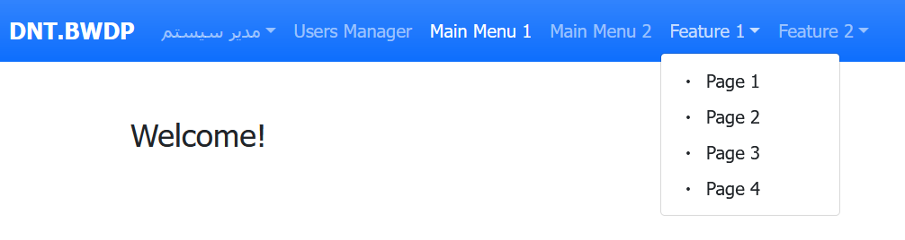

# Blazor WASM Dynamic Permissions

  

This is a sample project to demonstrate these features:
- How to mark client-side pages as protected and list all of them automatically.
- How to render a dynamic menu based on the protected pages list automatically.

- How to add an admin page to define allowed pages for different users dynamically.

- How to trim/hide the dynamically rendered menu items, based on the currently logged-in user's dynamic permissions.
- How to use JWT's to secure a Blazor WASM's app without using the ASP.NET Core Identity or IdentityServer.
- How to create refresh tokens and also use them before the expiration date of the current access token by using a custom timer.
- How to refresh tokens when the current access token is expired using Polly automatically.
- How to list all of the secured resources on the server automatically.
- How to define an admin page to define allowed resources on the server (action methods of different controllers) for different users dynamically.

## How to run the application

This sample is a Blazor WASM hosted project. To run it you should start the `src\Server` project first. It will create a new SQLite database automatically using the EF-Core's migrations and then seeds it with 3 predefined users which [their details can be found here](src/Server/appsettings.json). Use the Admin user's info to login to the app and then add/change the users' permissions. Now login as them and see the results, including the security trimming of the dynamically rendered menu items and the ability/inability of fetching the dynamically secured server-side resources. 